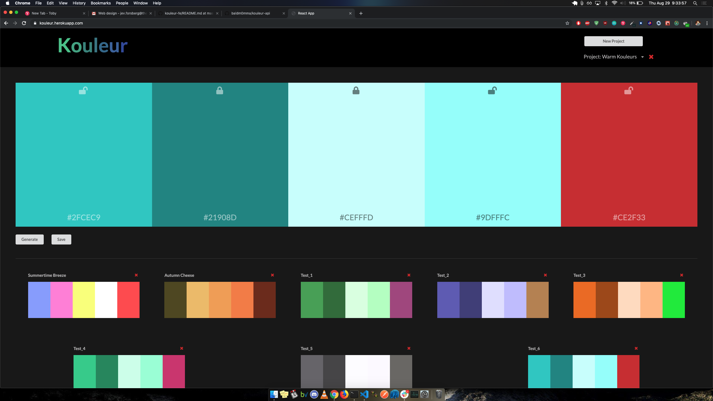
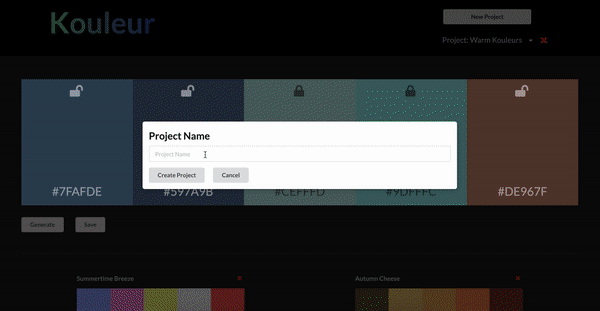

# Kouleur - A RESTful API consuming palette picking app

## Description

Kouleur is the React front-end of a full-stack color palette picker application. We used Semantic UI elements to style and design an elegant, thoughtful, and intuitive UI/UX experience. This FE app pairs with a PostgreSQL/Node.js/Express.js RESTful API which we also built our ourselves that utilizes semantic HTTP methods, intuitive url pathway naming conventions, and a one-to-many database of our own design. You can find the code for our API [here](https://github.com/baldm0mma/kouleur-api), or visit our deployed site [here on Heroku](https://kouleur.herokuapp.com/)

## Project Successes

REACT/REDUX PAIRING: We spent quite a bit of time discussing whether or not the use of a state management tool would be justified in this project. Ultimately, because of the nested nature of a number of our components/containers, we decided too much prop-drilling would be needed, and therefor Redux - while the setup is unarguably time consuming - would be worth our while in the end. That DID, fortunately, end up being the case. Data was considerably easier to manipulate and display with the usage of Redux, and certainly worth the time, effort, and coding-space.

SEMANTIC UI: This was our first time using a styling bootstrap; and even so, we only used one or two main components, i.e., our buttons, and our single dropdown. Semantic UI is based on Google's Material UI, and is easy and intuitive to use. All of our other components/containers were coded and styled by us exclusively (we believe that bootstrapping is a great too for small elements only), but nevertheless, the few hours we saved by not having to worry about the button and dropdown styling and structure let us focus on other small UI/UX details that really add value to the app.

SMALL DETAILS: We both believe that the devil, as well as the angels, reside in the details. That is why we spent a significant amount of time creating small, inconspicuous UX details. For example, our main color palette's swatches have a flex-scale of 1.3 on hover, giving a little bit of dynamism of movement when scrolling. Another detail we're proud of is swatch text and icon; depending on brightness of the background swatch color, the text and icon color will either display black - if the swatch color is light -  or while - if that swatch color is dark.

## Project Challenges

ASYNC TESTING: Front-end async testing is difficult for many developers, us included. It is not as simple as just testing an input/output; you need to mock functions, mock clicks, reassign global JavaScript object methods - like fetch - all before you can even begin the testing in the first place. Not to mention with asynchronous testing, there are always unforseen call-stack timing that often rear theer ugly heads. Nevertheless, we still managed %80 test coverage, and are very proud of that!

## Project Extensions/Issues

* Reach %95 test coverage.
* Display hexadecimal color codes on hover for the already created palette tiles.

## Project Tech Emphasis

* React
* Redux
* Jest
* Enzyme
* RESTful API fetches
* Semantic UI

## Project Management

We used GitHub Issues for our project management needs.

## Project Comps:

### Home Page

### GIFS

## Developers

[Jev Forsberg](https://github.com/baldm0mma/); [Evan Markowitz](https://github.com/evanmarkowitz)
