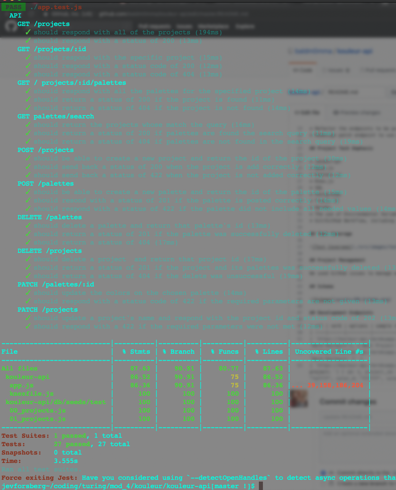

# BetterFlix

## Available Scripts

This project was bootstrapped with [Create React App](https://github.com/facebook/create-react-app).

In the project directory, you can run:

### `npm start`

Runs the app in the development mode. 
Open [http://localhost:3000](http://localhost:3000) to view it in the browser.

The page will reload if you make edits. 
You will also see any lint errors in the console.

### `npm test`

Launches the test runner in the interactive watch mode. 
See the section about [running tests](https://facebook.github.io/create-react-app/docs/running-tests) for more information.

### `npm build`

Will create a production ready build; ready for shipping.

### `npm eject`

Copies all the configuration files and the transitive dependencies right into the project so the dev can have full control over them.

## Test Coverage

## Description

This project is a movie app that allows the user to see now playing, popular, and currently top rated movies. The user can also select a genre to see all of the recommended movies in that genre. Once the user is logged in to their account and viewing movies, they can select a movie to see more information about the movie or favorite the movie. All of their favorite movies will be stored and are viewable upon re-login. If the user does not see a movie they are looking for, they can search for a specific movie. This project was completed in a week.

## Project Successes

This project required 1-2 api calls, however the modular code was build to run up to 20 different fetch calls to the moviedb to grab different sets of movie data. This increases the pleasure felt during the user experience as the user can select from a variety of movie genres. The developers implemented thunks for the first time and over half of the app has passing test coverage.

## Project Challenges

Writing modular code required careful planning and strategic architecture. Creating a flat redux store also proved to be a challenge. Working through merge conflicts was tedious mostly due to text editor formatting differences. The app stlying was up to the developers whereas other projects have had a style comp, so extra effort went into creating a cleanly styled app. Lastly, keeping track of local state vs the store was a conceptual hurdle.

## Project Extensions/Issues

* Only at 72% Test Coverage
* User Favorites need to be saved to store
* Redesign the store
* Change all fetchs to thunks

## Project Tech Emphasis

* HTML
* SCSS
* JavaScript
* React
* React Router
* Redux
* Jest
* Enzyme
* PropTypes
* ES6 Classes
* API fetches
* Thunks Middleware
* NPM

## Project Management

The team used a project management tool, Trello, and GitHub issues to manage workflow, along with Slack to manage remote communication.

### Trello Board

## Project Comps:

### Home Page

### Search

### Genres

### Genre Page

### Movie Card

### Favorites

### Favorites Error

### Sign In

### Create Account

### 404 Page

### GIFS

## Developers

[Patrick Goulding](https://github.com/pgoulding)
[Katherine Lewis](https://github.com/kalex19)
[Jev Forsberg](https://github.com/baldm0mma)

## Licensing

All credit goes to <a href="turing.io">Turing School of Software</a> for providing the project specifications.
